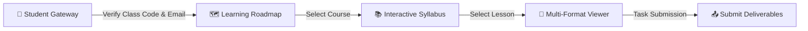
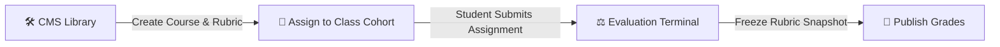

# 🎓 Teaching OS (STE)

<div align="center">

[](#)
[](#)
[](#)

<p align="center">
  A high-impact educational platform and learning operating system. Evolved from a professional data advisory portfolio, it combines a public showcase presence with private classroom roadmaps, syllabus tracking, interactive document viewports, and automated AI grading workflows.
</p>

### 🛠️ Built With

[](https://nextjs.org/)
[](https://react.dev/)
[](https://www.typescriptlang.org/)
[](https://tailwindcss.com/)
<br/>
[](https://supabase.com/)
[](https://www.postgresql.org/)
[](https://www.python.org/)
[](https://fastapi.tiangolo.com/)

---

[Explore Codebase Specs](file:///Users/mac/Data/STE/vuth-portfolio-main/codebase_specification.md) • [View Docs Index](file:///Users/mac/Data/STE/vuth-portfolio-main/docs/README.md) • [Features & UAT Verification Guide](file:///Users/mac/Data/STE/vuth-portfolio-main/docs/ELEARNING_FEATURES_VERIFICATION_GUIDE.md)

</div>

---

## 🌟 Key Application Surfaces

*   **🌐 Public Showcase Layer**: An elegant portfolio displaying consulting projects, student case studies, process mapping diagrams (React Flow), and visual before/after dashboard comparison sliders.
*   **🔑 Student Learning Gateway**: A secure area gated by class-code authorization and HTTP-Only cookies, allowing students to access course roadmaps, view materials, and submit assignments securely.
*   **🛠️ Admin CMS & Grading Terminal**: A centralized management workspace where administrators configure classes, assign syllabi, edit lesson content with Tiptap, and evaluate homework against frozen rubric snapshots.
*   **⚡ Multi-Format Materials Pipeline**: Automatically processes PDF, DOCX, CSV, and XLSX deliverables, creating polished web readviews and preview grids.

---

## 🔁 Core User Workflows

### 1. The Student Workspace Journey

1.  **Verification**: The learner lands on `/learn` and enters their whitelisted email and active class access code (e.g. `DATA-2026`).
2.  **Access**: Upon validation, a cookie-based session is created, routing them to `/learn/[classCode]/dashboard`.
3.  **Roadmap & Lessons**: The student interacts with the custom `React Flow` roadmap and reads PDF/DOCX lectures and previews CSV/XLSX datasets in the secure viewer, tracking their progress.
4.  **Submission**: Uploads files within the assignment limits; if insertion fails, transactional rollback cleans up uploaded storage items.

### 2. The Administrator CMS & Grading Loop

1.  **Curriculum Design**: Admins create subjects, syllabus courses, modules, and lessons inside `/admin/library`.
2.  **Class Operations**: Admins setup cohorts on `/admin/classes`, enabling whitelisting and generating custom access codes.
3.  **Rubric Snapshotting**: Captures a frozen criteria snapshot upon saving assignments to prevent grading drift.
4.  **Assessment**: Submissions land on `/admin/grading` where admins score homework using criteria-based rubrics.

---

## 🚀 Quick Start

### 1. Configure Secrets
Copy `.env.example` to `.env.local` inside the root directory, and copy `rubricore-engine/.env.example` to `rubricore-engine/.env`:
```bash
cp .env.example .env.local
cp rubricore-engine/.env.example rubricore-engine/.env
```

### 2. Install and Start Development
Run both services concurrently to enable AI grading:

**Terminal 1 (Next.js Application)**:
```bash
npm install
npm run dev
```

**Terminal 2 (RubriCore FastAPI Server & Worker)**:
```bash
cd rubricore-engine
python3 -m venv .venv
source .venv/bin/activate
pip install -r requirements.txt
# Start FastAPI web server
uvicorn app.pilot.fastapi_app:app --host 127.0.0.1 --port 8080
# Start background worker in another window
python -m app.worker
```

Open [http://localhost:3000](http://localhost:3000) to view the system.

### 3. Build & Test Production
```bash
npm run build
npm run start
```
