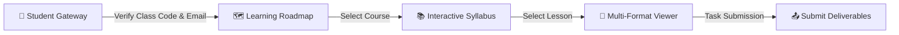
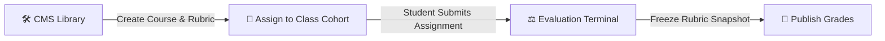

<div align="center">

# 🎓 Teaching OS (STE)

[](#)
[](#)
[](#)

**A high-impact educational platform and learning operating system.**

[](https://nextjs.org/)
[](https://react.dev/)
[](https://www.typescriptlang.org/)
[](https://tailwindcss.com/)
[](https://supabase.com/)
[](https://www.postgresql.org/)
[](https://www.python.org/)
[](https://fastapi.tiangolo.com/)

<a href="#-concept">Concept</a> ·
<a href="#-features">Features</a> ·
<a href="#-workflows">Workflows</a> ·
<a href="#-ai-grading--model-configurations">AI Grading</a> ·
<a href="#-quick-start">Quick Start</a>

</div>

> Teaching OS evolved from a professional data advisory portfolio into a public showcase presence with private classroom roadmaps, syllabus tracking, interactive document viewports, and automated AI grading workflows.

---

## 💡 Concept

Teaching OS (STE) combines a public-facing portfolio, secure student learning journeys, an administrator CMS, a RubriCore grading backend, and a self-evolving RAG knowledge base for instructional material and assessment workflows.

---

## ✨ Features

| Application surface | Description |
| --- | --- |
| Public showcase layer | An elegant portfolio displaying consulting projects, student case studies, process mapping diagrams with React Flow, and visual before/after dashboard comparison sliders. |
| Student learning gateway | A secure area gated by class-code authorization and HTTP-only cookies, allowing students to access course roadmaps, view materials, and submit assignments securely. |
| Admin CMS and grading terminal | A role-protected workspace with a dedicated Supabase SSR login where administrators configure classes, assign syllabi, author lesson content, manage the public portfolio, and evaluate homework against frozen rubric snapshots. |
| Self-evolving RAG and knowledge base CMS | A production-grade telemetry panel with `pgvector` and HNSW cosine index support for drag-and-drop file ingestion, a real-time playground, and visual semantic search drawer overrides to guide lesson composition. |
| Retro-terminal AI grading dossier | A high-impact CRT electron-beam console displaying ASCII confidence ratings, granular selection grids, and structured telemetry injections for AI-assisted grading assessments. |
| Multi-format materials pipeline | Automatically processes PDF, DOCX, CSV, and XLSX deliverables, creating polished web readviews and preview grids. |

---

## 🔁 Workflows

### Student Workspace Journey


```mermaid
graph LR
    Gateway["🔑 Student Gateway"] -->|Verify Class Code & Email| Dashboard["🗺️ Learning Roadmap"]
    Dashboard -->|Select Course| Syllabus["📚 Interactive Syllabus"]
    Syllabus -->|Select Lesson| Viewer["📄 Multi-Format Viewer"]
    Viewer -->|Task Submission| Action["📤 Submit Deliverables"]
```

| Step | Flow |
| --- | --- |
| Verification | The learner lands on `/learn` and enters their whitelisted email and active class access code, such as `DATA-2026`. |
| Access | Upon validation, a cookie-based session is created, routing them to `/learn/[classCode]/dashboard`. |
| Roadmap and lessons | The student interacts with the custom `React Flow` roadmap and reads PDF/DOCX lectures and previews CSV/XLSX datasets in the secure viewer, tracking their progress. |
| Submission | Uploads files within the assignment limits; if insertion fails, transactional rollback cleans up uploaded storage items. |

### Administrator CMS and Grading Loop


```mermaid
graph LR
    CMS["🛠️ CMS Library"] -->|Create Course & Rubric| Cohort["🏫 Assign to Class Cohort"]
    Cohort -->|Student Submits Assignment| Grading["⚖️ Evaluation Terminal"]
    Grading -->|Freeze Rubric Snapshot| Publish["📢 Publish Grades"]
```

| Step | Flow |
| --- | --- |
| Authentication | Administrators sign in at `/admin/login`; the server refreshes the Supabase cookie session and authorizes roles from protected `app_metadata`. |
| Curriculum design | Admins manage subjects, courses, modules, and lessons directly via the inline syllabus designer inside `/admin/library`, and compose materials using a guided 3-step or 4-step wizard (dynamically skipping step 4 if there are no approved essay/coding questions) in the lesson editor. |
| Class operations | Admins set up cohorts on `/admin/classes`, enabling whitelisting and generating custom access codes. |
| Rubric snapshotting | Captures a frozen criteria snapshot upon saving assignments to prevent grading drift. |
| Assessment | Submissions land on `/admin/grading` where admins score homework using criteria-based rubrics. |

---

## 🧠 Self-Evolving RAG & Tactical CRT Telemetry

### Pedagogical Flywheel Ingestion

Rather than relying solely on static syllabus uploads, such as textbook PDFs or programming guides, the system features a self-evolving ingestion flywheel.

1. The system aggregates the core lesson body, grading rubrics, assignment questions, and expected answers into a unified Markdown guide.
2. This guide is sent asynchronously to the RubriCore backend, chunked, and vector-embedded using **Gemini text-embedding-004** inside the PostgreSQL `pgvector` store.
3. Over time, future generative pipelines, including rubric compositions and assignment builders, query this RAG dataset so the AI naturally aligns with the teacher's exact grading standards, pedagogy strictness, and instructional style.

### Reciprocal Rank Fusion Hybrid Search

The system implements a state-of-the-art RRF hybrid retrieval query that fuses two complementary strategies:

| Strategy | Role |
| --- | --- |
| Vector semantic scan | Searches structural HNSW cosine-similarity coordinates mapped from deep-learning embeddings. |
| Fallback keyword regex match | Ensures direct keyword queries, such as `try-except` or precise syntax rules, are matched exactly even if semantic embeddings are temporarily offline. |

### Monochromatic Retro CRT Dossier

To bring exceptional visual clarity and tactical precision to teachers, grading suggestions are loaded in a high-contrast monochromatic console modal styled like a classic phosphor screen scanline terminal.

| Element | Description |
| --- | --- |
| Confidence bar charts | ASCII block graphs, such as `[████████░░] 80% HIGH_CONF`, illustrating the AI model's assessment security. |
| Score injection matrix | Detailed criterion selectors allowing teachers to cherry-pick which recommendations to feed directly into the canvas. |
| Transmission stream | Monochrome terminal tabs showcasing parsed student answers and connected datasets. |

---

## 🤖 AI Grading & Model Configurations

The RubriCore background worker evaluates submissions against rubrics using either local models or cloud-based APIs.

| Provider | Configuration |
| --- | --- |
| Google Gemini API | Recommended for fast, high-accuracy grading with `gemini-2.5-flash`, `gemini-2.5-pro`, or `gemini-3.1-flash-lite`. Add `GEMINI_API_KEY` in `rubricore-engine/.env`. |
| Groq Cloud API | Supports high-end inference for open weights models like `llama-3.3-70b-specdec`. Add `GROQ_API_KEY` in `rubricore-engine/.env`. |
| OpenRouter API | Provides access to multiple open models such as `google/gemini-2.5-flash:free` and `deepseek/deepseek-r1:free` with auto-fallback. Add `OPENROUTER_API_KEY` in `rubricore-engine/.env`. |
| Local Ollama | Runs grades locally with open-source models for privacy and zero cost. Configure `OLLAMA_BASE_URL` and `OLLAMA_MODEL` in `rubricore-engine/.env`. |

Example provider settings:

```env
GEMINI_API_KEY=your_gemini_api_key_here
GROQ_API_KEY=your_groq_api_key_here
OPENROUTER_API_KEY=your_openrouter_api_key_here
OLLAMA_BASE_URL=http://localhost:11434
OLLAMA_MODEL=deepseek-r1
```

Pull an Ollama model before using the local provider:

```bash
ollama pull deepseek-r1
```

---

## 🚀 Quick Start

### Configure Secrets

Copy `.env.example` to `.env.local` inside the root directory, and copy `rubricore-engine/.env.example` to `rubricore-engine/.env`:

```bash
cp .env.example .env.local
cp rubricore-engine/.env.example rubricore-engine/.env
```

### Install and Start Development

Run both services concurrently to enable AI grading.

Terminal 1, Next.js application:

```bash
npm install
npm run dev
```

Terminal 2, RubriCore FastAPI server and worker:

```bash
cd rubricore-engine
python3 -m venv .venv
source .venv/bin/activate
pip install -r requirements.txt
uvicorn app.pilot.fastapi_app:app --host 127.0.0.1 --port 8080
python -m app.worker
```

Open [http://localhost:3000](http://localhost:3000) to view the system.

### Build and Test Production

```bash
npm run lint
npm run test
npm run build
npm run start
```

The default test suite is read-only against Supabase. A live write-path smoke test is available only for an explicitly approved linked staging project:

```bash
node --env-file=.env.local scripts/live-staging-smoke.mjs --confirm-live
```

It creates only disposable `CODEX_QA_*` records and removes its database rows, storage objects, and temporary Auth user in a `finally` cleanup.

---

## 🏗️ Tech Stack

| Layer | Technology |
| --- | --- |
| Web application | Next.js, React, TypeScript |
| Styling | Tailwind CSS |
| Data platform | Supabase Auth/SSR, PostgreSQL, Storage, RLS, `pgvector` |
| Backend worker | Python, FastAPI |
| Knowledge retrieval | HNSW cosine index, RRF hybrid retrieval |
| AI providers | Gemini, Groq, OpenRouter, Ollama |

<details>
<summary>📁 Project References</summary>

- [Explore Codebase Specs](codebase_specification.md)
- [View Docs Index](docs/README.md)
- [Features & UAT Verification Guide](docs/ELEARNING_FEATURES_VERIFICATION_GUIDE.md)

</details>
