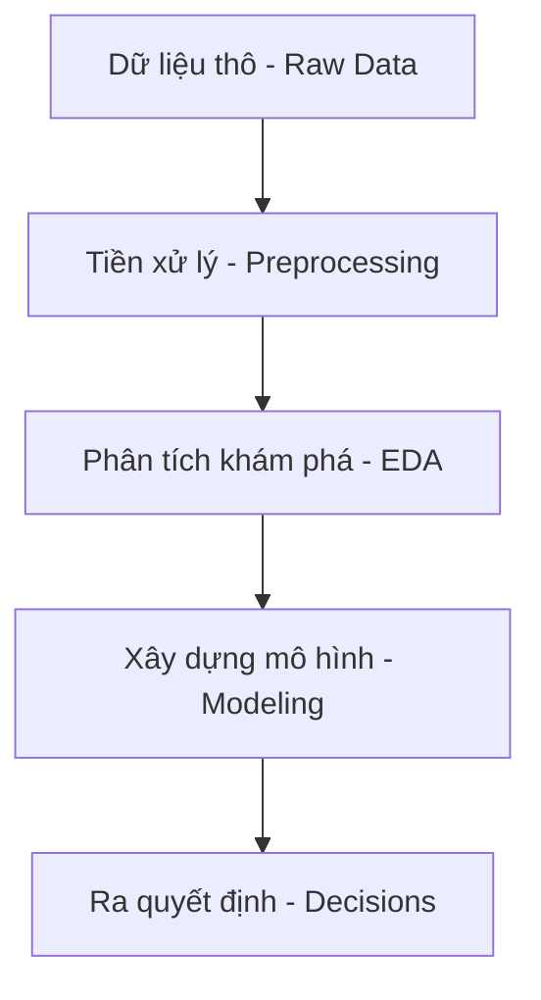
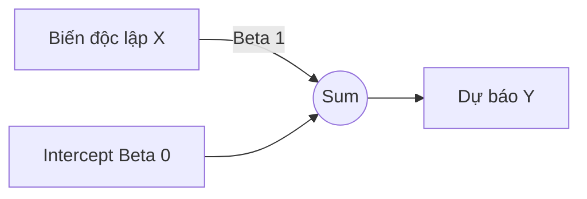
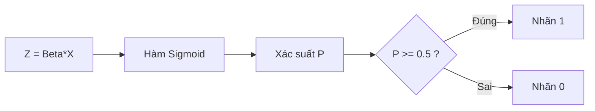
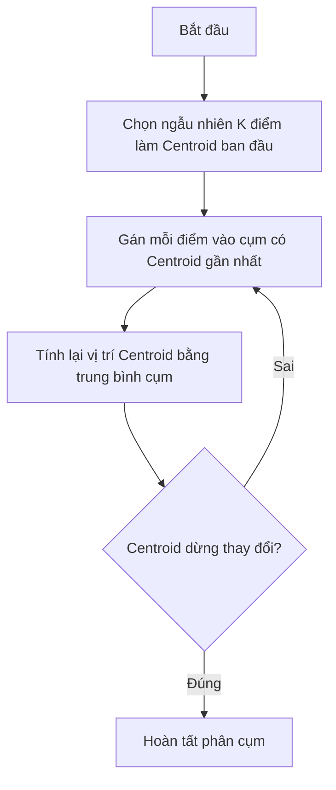
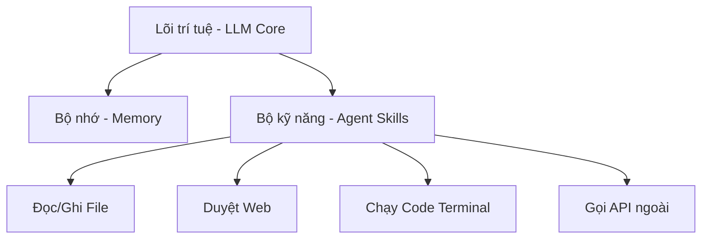

# Giáo trình Lý thuyết: Phân tích Dữ liệu Ứng dụng (Applied Predictive Modeling - APM)

Chào mừng các bạn đến với học phần **Phân tích Dữ liệu Ứng dụng (APM)**. Giáo trình này tổng hợp toàn bộ nền tảng lý thuyết, công thức toán học và mã nguồn thực hành từ cơ bản đến nâng cao nhằm giúp các bạn xây dựng mô hình dự báo và đưa ra quyết định dựa trên dữ liệu.

---

## Bài 1: Giới thiệu Môn học & Python Cơ bản

Học phần APM tập trung chuyển hóa dữ liệu thô thành các quyết định kinh doanh có giá trị thông qua việc kết hợp toán thống kê, kỹ năng lập trình và sự am hiểu lĩnh vực kinh doanh (Domain Knowledge).



### 1. Cú pháp Python Cơ bản dành cho Data Analyst
Trong Python, kiểu dữ liệu được tự động nhận diện mà không cần khai báo tường minh:

```python
# Khai báo biến
student_name = "Nguyễn Văn A"      # Chuỗi (string)
age = 22                           # Số nguyên (integer)
gpa = 8.4                          # Số thực (float)
is_enrolled = True                 # Logic (boolean)
```

#### Cấu trúc dữ liệu chính: List và Dictionary
* **List**: Danh sách tuần tự, cho phép trùng lặp. Cú pháp: `[item1, item2]`.
* **Dictionary**: Tập hợp cặp Khóa - Giá trị (Key - Value). Cú pháp: `{"key": value}`.

```python
# Ví dụ sử dụng List và Dictionary
sales_records = [120.5, 95.0, 110.2]
student_profile = {
    "id": "STE-1002",
    "name": "Trần Thị B",
    "courses": ["APM", "SQL-101"]
}
```

### 2. Cấu trúc điều khiển và Vòng lặp
* **Cấu trúc rẽ nhánh (if-elif-else)**:
```python
average_score = 7.8
if average_score >= 8.0:
    rank = "Giỏi"
elif average_score >= 6.5:
    rank = "Khá"
else:
    rank = "Trung bình"
```

* **Vòng lặp (for)**:
```python
total_sales = 0
for sale in sales_records:
    total_sales += sale
```

---

## Bài 2: Làm việc với Dữ liệu & Numpy/Pandas

Numpy và Pandas là hai thư viện nền tảng hàng đầu của Python dành cho khoa học dữ liệu, giúp tính toán hiệu năng cao và thao tác bảng dữ liệu.

### 1. NumPy - Tính toán Hiệu năng cao
NumPy cung cấp mảng đa chiều `ndarray` tối ưu hóa tính toán ma trận và đại số tuyến tính nhanh hơn hàng chục lần so với Python List thông thường.

```python
import numpy as np

# Tạo mảng doanh thu và tính thống kê mô tả
revenue = np.array([120, 150, 190, 80, 250])
mean_rev = np.mean(revenue)
std_rev = np.std(revenue)
```

### 2. Pandas - Thao tác Bảng Dữ liệu (Dataframe)
Pandas cung cấp đối tượng `DataFrame` tương tự như một bảng tính Excel giúp lọc, ghép, gom nhóm dữ liệu linh hoạt.

```python
import pandas as pd

data = {
    'Customer_ID': ['KH01', 'KH02', 'KH03', 'KH04'],
    'Age': [25, 34, 45, 22],
    'Spent': [500000, 1200000, 850000, 300000]
}
df = pd.DataFrame(data)

# Lọc khách hàng VIP
vip_customers = df[df['Spent'] > 500000]
```

---

## Bài 3: Hồi quy Tuyến tính (Linear Regression)

Hồi quy tuyến tính là thuật toán Học máy có giám sát (Supervised Learning) cơ bản nhất, dùng để dự báo một giá trị liên tục.

### 1. Nguyên lý Hoạt động
Hồi quy tuyến tính tìm cách vẽ một đường thẳng biểu diễn mối quan hệ giữa biến độc lập $X$ và biến phụ thuộc $Y$ sao cho tổng sai số bình phương giữa giá trị thực tế và giá trị dự báo đạt tối thiểu (Ordinary Least Squares - OLS).

Phương trình dạng đơn biến:
$$Y = \beta_0 + \beta_1 X + \epsilon$$



### 2. Các chỉ số Đánh giá Mô hình Hồi quy
| Chỉ số | Tên đầy đủ | Ý nghĩa | Công thức |
| :--- | :--- | :--- | :--- |
| **$R^2$** | R-squared | Tỷ lệ phương sai của Y được giải thích bởi X | $1 - \frac{SS_{res}}{SS_{tot}}$ |
| **MAE** | Mean Absolute Error | Sai số tuyệt đối trung bình | $\frac{1}{n}\sum |y_i - \hat{y}_i|$ |
| **MSE** | Mean Squared Error | Sai số bình phương trung bình | $\frac{1}{n}\sum (y_i - \hat{y}_i)^2$ |

### 3. Triển khai với Scikit-learn
```python
from sklearn.linear_model import LinearRegression
import numpy as np

X = np.array([[50], [60], [70], [80], [100]])
y = np.array([1.5, 1.8, 2.1, 2.5, 3.2])

model = LinearRegression().fit(X, y)
predicted_price = model.predict([[90]])
```

---

## Bài 4: Hồi quy Phi tuyến tính (Nonlinear Regression)

Nhiều mối quan hệ thực tế không tuân theo dạng đường thẳng tuyến tính mà có dạng cong. Hồi quy phi tuyến tính cung cấp giải pháp dự báo linh hoạt hơn.

### 1. Hồi quy Đa thức (Polynomial Regression)
Thêm các lũy thừa bậc cao của biến $X$ vào phương trình tuyến tính để mô tả đường cong Parabol:
$$Y = \beta_0 + \beta_1 X + \beta_2 X^2 + \epsilon$$

```python
from sklearn.preprocessing import PolynomialFeatures
from sklearn.linear_model import LinearRegression
import numpy as np

X = np.array([[1], [2], [3], [4], [5]])
y = np.array([2, 5, 10, 17, 26])

X_poly = PolynomialFeatures(degree=2).fit_transform(X)
model = LinearRegression().fit(X_poly, y)
```

### 2. Mô hình Phi tuyến tính Tổng quát
| Dạng mô hình | Công thức mẫu | Lĩnh vực áp dụng |
| :--- | :--- | :--- |
| **Exponential (Hàm mũ)** | $Y = a \cdot e^{bX}$ | Tăng trưởng dân số, lãi kép |
| **Logarithmic (Hàm Log)** | $Y = a + b \cdot \ln(X)$ | Độ thỏa dụng cận biên giảm dần |
| **Logistic (Hàm Sigmoid)** | $Y = \frac{L}{1 + e^{-k(X-X_0)}}$ | Tăng trưởng sinh học có giới hạn |

---

## Bài 5: Giới thiệu Bài toán Hồi quy Nâng cao

Khi mô hình có quá nhiều biến độc lập, chúng ta dễ gặp hiện tượng quá khớp (Overfitting) hoặc đa cộng tuyến (Multicollinearity). Hồi quy nâng cao sử dụng kỹ thuật chính quy hóa (Regularization) để giải quyết điểm yếu này.

### 1. Kỹ thuật Chính quy hóa (Regularization)
Chính quy hóa cộng thêm một đại lượng phạt (penalty term) vào hàm mất mát để hạn chế các hệ số $\beta$ tăng quá lớn.

* **Ridge Regression (L2 Regularization)**: Phạt bình phương các hệ số: $\lambda \sum \beta_j^2$. Thu nhỏ hệ số về gần 0 nhưng không triệt tiêu.
* **Lasso Regression (L1 Regularization)**: Phạt trị tuyệt đối các hệ số: $\lambda \sum |\beta_j|$. Có thể triệt tiêu hệ số về hẳn 0, hỗ trợ lựa chọn đặc trưng (Feature Selection).

```python
from sklearn.linear_model import Lasso
import numpy as np

X = np.array([[1, 2], [2, 3], [3, 4], [4, 5]])
y = np.array([2.5, 3.5, 4.8, 5.9])

lasso = Lasso(alpha=0.1).fit(X, y)
```

---

## Bài 6: Giới thiệu Bài toán Phân loại (Classification)

Phân loại nhằm mục đích gán nhãn một mẫu dữ liệu vào một hoặc nhiều nhóm phân biệt (Discrete Classes).

### 1. Hồi quy Logistic (Logistic Regression)
Được dùng cho bài toán phân loại nhị phân (Binary Classification). Mô hình chuyển đổi kết quả tuyến tính qua hàm kích hoạt **Sigmoid** đưa đầu ra về khoảng xác suất $[0, 1]$:
$$P(Y=1|X) = \sigma(Z) = \frac{1}{1 + e^{-Z}}$$



### 2. Các Thuật toán Phân loại Phổ biến khác
* **K-Nearest Neighbors (KNN)**: Phân loại theo nhãn số đông của $K$ điểm dữ liệu lân cận gần nhất.
* **Support Vector Machine (SVM)**: Tìm đường ranh giới (Hyperplane) phân tách các lớp dữ liệu sao cho khoảng cách (Margin) đạt cực đại.
* **Decision Tree (Cây quyết định)**: Rẽ nhánh phân loại dựa trên tập quy tắc logic dạng cây.

---

## Bài 7: Tiền xử lý Dữ liệu & Chuẩn bị Case Study

Tiền xử lý là bước bắt buộc để làm sạch và định dạng dữ liệu thô trước khi đưa vào mô hình học máy.

### 1. Xử lý Dữ liệu khuyết thiếu và Trùng lặp
* **Dữ liệu khuyết thiếu (Missing values)**: Thay thế bằng các giá trị thống kê như trung vị (`median`) hoặc trung bình (`mean`) phân nhóm.
```python
# Thay thế giá trị khuyết thiếu theo nhóm cửa hàng tương ứng
df['Revenue'] = df.groupby('Store')['Revenue'].transform(lambda x: x.fillna(x.mean()))
```

### 2. Mã hóa biến Phân loại & Chuẩn hóa biến Số
* **One-Hot Encoding**: Biến đổi biến danh mục thành các cột nhị phân (0 hoặc 1).
* **Chuẩn hóa (Scaling)**: Co giãn biến số về cùng biên độ giá trị thông qua `StandardScaler` (phân phối chuẩn hóa trung bình bằng 0, độ lệch chuẩn bằng 1) hoặc `MinMaxScaler` (đoạn $[0, 1]$).

---

## Bài 8: Đánh giá Mô hình Phân loại (Classification)

Để đánh giá chất lượng mô hình phân loại, chúng ta sử dụng các chỉ số tính toán từ ma trận nhầm lẫn (Confusion Matrix).

### 1. Ma trận Nhầm lẫn (Confusion Matrix)
| | Dự báo: Positive | Dự báo: Negative |
| :--- | :--- | :--- |
| **Thực tế: Positive** | True Positive (TP) | False Negative (FN) |
| **Thực tế: Negative** | False Positive (FP) | True Negative (TN) |

* **Accuracy (Độ chính xác tổng thể)**: Tỷ lệ dự báo đúng trên tổng số mẫu.
  $$\text{Accuracy} = \frac{TP + TN}{TP + TN + FP + FN}$$
* **Precision (Độ chuẩn xác)**: Độ chính xác trong số các trường hợp dự đoán là Positive.
  $$\text{Precision} = \frac{TP}{TP + FP}$$
* **Recall (Độ nhạy / Thu hồi)**: Tỷ lệ nhận diện được các trường hợp thực tế là Positive.
  $$\text{Recall} = \frac{TP}{TP + FN}$$
* **F1-Score**: Trung bình điều hòa giữa Precision và Recall.

---

## Bài 9: Thuật toán Phân cụm K-Means Clustering

Phân cụm là bài toán Học không giám sát (Unsupervised Learning) giúp gom cụm các điểm dữ liệu tương đồng mà không cần nhãn trước.

### 1. Nguyên lý Hoạt động của K-Means
K-Means phân chia các mẫu dữ liệu vào $K$ cụm thông qua tối thiểu hóa khoảng cách Euclid từ các điểm tới tâm cụm (centroid) tương ứng.



### 2. Xác định số cụm K tốt nhất
* **Phương pháp Elbow (Cùi chỏ)**: Tìm điểm uốn gãy trên đồ thị biểu diễn sai số WCSS giảm dần tương ứng với số cụm $K$.
* **Silhouette Score**: Đánh giá độ chặt chẽ nội cụm và tách biệt ngoại cụm (khoảng $[-1, 1]$).

---

## Bài 10: Khai phá Luật kết hợp (Association Rules)

Tìm kiếm các mối quan hệ ẩn giữa các mặt hàng trong tập dữ liệu giao dịch lớn (Market Basket Analysis).

### 1. Chỉ số đo lường luật $\{A\} \rightarrow \{B\}$
* **Support**: Tỷ lệ giao dịch chứa đồng thời A và B: $\text{Support}(A \rightarrow B) = P(A \cap B)$.
* **Confidence**: Độ tin cậy mua B khi đã mua A: $\text{Confidence}(A \rightarrow B) = P(B|A)$.
* **Lift**: Đo lường sự phụ thuộc lẫn nhau: $\text{Lift}(A \rightarrow B) = \frac{\text{Support}(A \rightarrow B)}{\text{Support}(A) \cdot \text{Support}(B)}$. Lift > 1 thể hiện quan hệ tương hỗ tích cực.

### 2. Thuật toán Apriori
Tận dụng tính chất: mọi tập con của một tập hợp mặt hàng thường xuyên cũng phải là tập hợp mặt hàng thường xuyên để cắt giảm nhanh không gian tính toán.

---

## Bài 11: Case Study: Retail Marketing & Telecom

Ứng dụng trực tiếp các mô hình học máy vào hai bài toán thực tiễn kinh điển: Dự báo rời bỏ mạng viễn thông (Telecom Churn) và Phân khúc tiếp thị bán lẻ (Retail Marketing).

### 1. Telecom Churn Classification (Hồi quy phân loại)
* **Xử lý mất cân bằng mẫu**: Nhóm khách hàng rời mạng thường chiếm tỷ lệ nhỏ (~26.5%). Áp dụng thuật toán **SMOTE** để tạo mẫu nhân tạo cho nhóm thiểu số.
* **Xây dựng mô hình**: Kết hợp `OneHotEncoder`, `StandardScaler` và mô hình rừng ngẫu nhiên `RandomForestClassifier` kết hợp dò tham số `GridSearchCV`.

```python
from imblearn.over_sampling import SMOTE
from sklearn.ensemble import RandomForestClassifier
from sklearn.model_selection import GridSearchCV

smote = SMOTE(random_state=42)
X_train_res, y_train_res = smote.fit_resample(X_train_processed, y_train)

param_grid = {'n_estimators': [100, 200], 'max_depth': [10, 20]}
grid_search = GridSearchCV(RandomForestClassifier(random_state=42), param_grid, cv=5, scoring='f1')
grid_search.fit(X_train_res, y_train_res)
```

### 2. Retail Customer Segmentation (Phân cụm)
* **Giảm chiều dữ liệu với PCA**: Dữ liệu tiếp thị bán lẻ có số chiều lớn (39 biến). Áp dụng **PCA** để trích xuất 3 thành phần chính quan trọng trước khi đưa vào mô hình phân cụm K-Means nhằm tránh hiện tượng loãng khoảng cách (Curse of Dimensionality).
* **Thuật toán mật độ DBSCAN**: Phân cụm dựa trên mật độ điểm dữ liệu, nhận diện tốt nhiễu ngoại lai. Dùng đồ thị khoảng cách k-distance để tìm bán kính `eps` tối ưu tự động.

---

## Bài 12: Nghiên cứu & Phân tích Dữ liệu trong Kỷ nguyên AI

Kỹ năng cốt lõi (meta-skills) giúp Data Analyst làm việc cộng tác hiệu quả và an toàn với trí tuệ nhân tạo (AI).

### 1. Nghiên cứu & Khai phá Thông tin bằng AI
* **Công cụ**: Sử dụng **ChatGPT/Gemini** để dịch nghĩa, giải thích khái niệm; sử dụng **Perplexity** để tra cứu thông tin thời gian thực đính kèm nguồn trích dẫn uy tín.
* **Quy tắc Kiểm chứng Chéo (Cross-Verification)**: Luôn kiểm tra lại cú pháp hoặc thông tin do AI đề xuất với tài liệu lập trình chính thức (Official Documentation).

### 2. Tìm hiểu về AI Agent & Khái niệm "Skills"
AI Agent là hệ thống thông minh có khả năng tự lập kế hoạch và gọi các công cụ (Skills) thích hợp để xử lý công việc.



* **Coding Agent nổi bật**: **Codex (GitHub Copilot)** hỗ trợ tự động gợi ý mã nguồn, **Google Antigravity** hay **Devin** thực hiện vòng lặp tự sửa lỗi tự động trong môi trường phát triển thực tế.

### 3. Thực hành lập trình với mô hình OpenCode
* **Mô hình**: Ưu tiên sử dụng mô hình nguồn mở tối ưu cho lập trình như **DeepSeek-Coder**, **Llama-3-Coder**, hoặc **Qwen-Coder** để bảo vệ dữ liệu nội bộ và tiết kiệm chi phí.
* **Bảo mật dữ liệu (Data Privacy)**: Tuyệt đối không tải các dữ liệu nhạy cảm hoặc mã nguồn độc quyền của doanh nghiệp lên các AI chatbot công cộng.
