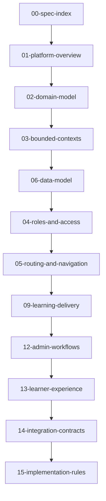

# Specification Pack Index

## Purpose of the Specification Pack
This specification pack converts the high-level architecture of Version 3 of the Data Advisor Education Platform into a build-ready blueprint. It serves as a direct reference for coding agents and developer environments, containing strict rules, database schemas, access control models, routing paths, integration APIs, and coding guidelines.

## Document Inventory and Read Order
Implementation agents and developers must read these documents in the following order:

1.  **[01-platform-overview.md](file:///Users/mac/Data/STE/vuth-portfolio-main/docs/specs/01-platform-overview.md)**: Product mission, application zones, and the preservation of the marketing/portfolio layer.
2.  **[02-domain-model.md](file:///Users/mac/Data/STE/vuth-portfolio-main/docs/specs/02-domain-model.md)**: Unified domain terminology, relationships, and edge cases.
3.  **[03-bounded-contexts.md](file:///Users/mac/Data/STE/vuth-portfolio-main/docs/specs/03-bounded-contexts.md)**: System boundaries, database write-ownership, read restrictions, and inter-context communication patterns.
4.  **[04-roles-and-access.md](file:///Users/mac/Data/STE/vuth-portfolio-main/docs/specs/04-roles-and-access.md)**: Detailed permission matrix mapping 8 roles to 14 actions, with JWT auth rules and Row Level Security (RLS) policies.
5.  **[05-routing-and-navigation.md](file:///Users/mac/Data/STE/vuth-portfolio-main/docs/specs/05-routing-and-navigation.md)**: Next.js App Router directories, layout groups, navigation logic, and middleware intercept definitions.
6.  **[06-data-model.md](file:///Users/mac/Data/STE/vuth-portfolio-main/docs/specs/06-data-model.md)**: Full PostgreSQL schema blueprints, foreign key behaviors, composite indexes, and version-pointer structures.
7.  **[07-storage-and-assets.md](file:///Users/mac/Data/STE/vuth-portfolio-main/docs/specs/07-storage-and-assets.md)**: Supabase Storage configurations, directory naming conventions, file naming rules, and signed url validation logic.
8.  **[08-content-system.md](file:///Users/mac/Data/STE/vuth-portfolio-main/docs/specs/08-content-system.md)**: Canonical content catalog rules, tags/taxonomy controls, versioning rules, and review/archival lifecycles.
9.  **[09-learning-delivery.md](file:///Users/mac/Data/STE/vuth-portfolio-main/docs/specs/09-learning-delivery.md)**: Class code checks, scheduling offsets, release gates, and syllabus synchronization strategies.
10. **[10-assessment-and-submissions.md](file:///Users/mac/Data/STE/vuth-portfolio-main/docs/specs/10-assessment-and-submissions.md)**: Assignment schemas, student upload limits, late submission tags, and verification rules.
11. **[11-grading-and-rubrics.md](file:///Users/mac/Data/STE/vuth-portfolio-main/docs/specs/11-grading-and-rubrics.md)**: Rubric evaluation matrix structure, manual scoring layouts, auto-grading write hooks, and draft/publication status guidelines.
12. **[12-admin-workflows.md](file:///Users/mac/Data/STE/vuth-portfolio-main/docs/specs/12-admin-workflows.md)**: Detailed admin workflow charts mapping authoring, class setup, evaluation reviews, and archiving tasks.
13. **[13-learner-experience.md](file:///Users/mac/Data/STE/vuth-portfolio-main/docs/specs/13-learner-experience.md)**: Student navigation layouts, roadmap graphs (`reactflow`), document views, and grade notifications.
14. **[14-integration-contracts.md](file:///Users/mac/Data/STE/vuth-portfolio-main/docs/specs/14-integration-contracts.md)**: Async webhook/callback JSON payload structures, API route contracts, security tokens, and signature checks.
15. **[15-implementation-rules.md](file:///Users/mac/Data/STE/vuth-portfolio-main/docs/specs/15-implementation-rules.md)**: The strict coding guidelines. Defines typescript naming conventions, schema parameters, module boundaries, and validation requirements.
16. **[16-open-decisions.md](file:///Users/mac/Data/STE/vuth-portfolio-main/docs/specs/16-open-decisions.md)**: Open-ended choices requiring teacher/administrator final approval.
17. **[AGENTS.md](file:///Users/mac/Data/STE/vuth-portfolio-main/docs/specs/AGENTS.md)**: Command instructions for coding agents, specifying code constraints, dependency trees, and behavior guidelines.

---
## Relationships and Information Flow

