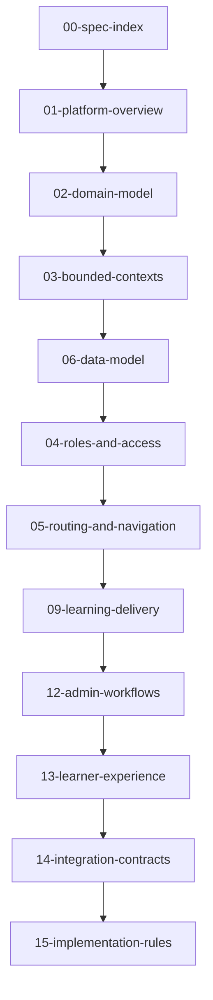

# Specification Pack Index

## 🎯 Purpose of the Specification Pack
This specification pack converts the high-level architecture of Version 3 of the Data Advisor Education Platform into a build-ready blueprint. It serves as a direct reference for coding agents and developer environments, containing strict rules, database schemas, access control models, routing paths, integration APIs, and coding guidelines.

---

## 🎨 Bright White Tone Theme Guidelines
All surfaces across the Teaching OS must render using the **Light theme** (defaulting to the `light` HTML class):
- **Layout Background**: `#ffffff` (White background, mapped from `bg-slate-950`).
- **Sidebar & Cards**: `#f8fafc` / `#f1f5f9` (Mapped from `bg-slate-900` / `bg-slate-850`).
- **Text & Contrast**: `#0f172a` (Dark slate, mapped from `text-slate-100` / `text-white`).
- **Borders & Dividers**: `#e2e8f0` (Light gray, mapped from `border-slate-800`).

---

## 🔁 Reference Workflows

### Learner Session Workflow
1. **Gateway (`/learn`)**: Student inputs a whitelisted email and active access code.
2. **JWT Cookie Generation**: API endpoint `/api/v1/verify-code` verifies the inputs and outputs a signed JWT cookie.
3. **Roadmap & Syllabi**: Learner is directed to `/learn/[classCode]/dashboard` to view active lessons and assigned PDF coursework.

### Administration CMS & Grading Workflow
1. **Course Authoring**: Admin creates courses, modules, and lessons inside `/admin/library`.
2. **Cohort Release**: Admin whitelists emails and sets release dates inside `/admin/classes`.
3. **Scoring Submissions**: Admin opens `/admin/grading/[submissionId]` to grade tasks against criteria weightings and publishes results.

---

## 📁 Document Inventory & Read Order

1.  **[01-platform-overview.md](01-platform-overview.md)**: Product mission and application zones.
2.  **[02-domain-model.md](02-domain-model.md)**: Unified domain terminology and edge cases.
3.  **[03-bounded-contexts.md](03-bounded-contexts.md)**: System boundaries and write-ownership.
4.  **[04-roles-and-access.md](04-roles-and-access.md)**: Permission matrix mapping.
5.  **[05-routing-and-navigation.md](05-routing-and-navigation.md)**: Next.js App Router folders and layout grids.
6.  **[06-data-model.md](06-data-model.md)**: Database Postgres tables schema.
7.  **[07-storage-and-assets.md](07-storage-and-assets.md)**: Supabase Storage file rules.
8.  **[08-content-system.md](08-content-system.md)**: Content catalog rules and drafts.
9.  **[09-learning-delivery.md](09-learning-delivery.md)**: Release gates and calendars.
10. **[10-assessment-and-submissions.md](10-assessment-and-submissions.md)**: Upload validation rules.
11. **[11-grading-and-rubrics.md](11-grading-and-rubrics.md)**: Evaluation score matrix mapping.
12. **[12-admin-workflows.md](12-admin-workflows.md)**: Flowcharts for CMS tasks.
13. **[13-learner-experience.md](13-learner-experience.md)**: Roadmap React Flow views.
14. **[14-integration-contracts.md](14-integration-contracts.md)**: Webhooks schemas.
15. **[15-implementation-rules.md](15-implementation-rules.md)**: Coding guidelines.
16. **[16-open-decisions.md](16-open-decisions.md)**: Pending CMS updates.
17. **[17-rag-knowledge-hub.md](17-rag-knowledge-hub.md)**: RAG & Knowledge Library specifications.
18. **[18-rag-knowledge-engine.md](18-rag-knowledge-engine.md)**: Self-Evolving Knowledge Engine — Full Vision.
19. **[AGENTS.md](../../AGENTS.md)**: Command guidelines.

---

## 🔁 Relationships and Information Flow

```mermaid
graph TD
    Index[00-spec-index] --> Overview[01-platform-overview]
    Overview --> Domain[02-domain-model]
    Domain --> Contexts[03-bounded-contexts]
    Contexts --> DataModel[06-data-model]
    DataModel --> RolesAccess[04-roles-and-access]
    RolesAccess --> Routing[05-routing-and-navigation]
    Routing --> Delivery[09-learning-delivery]
    Delivery --> Workflows[12-admin-workflows]
    Workflows --> Learners[13-learner-experience]
    Learners --> Contracts[14-integration-contracts]
    Contracts --> Rules[15-implementation-rules]
```
