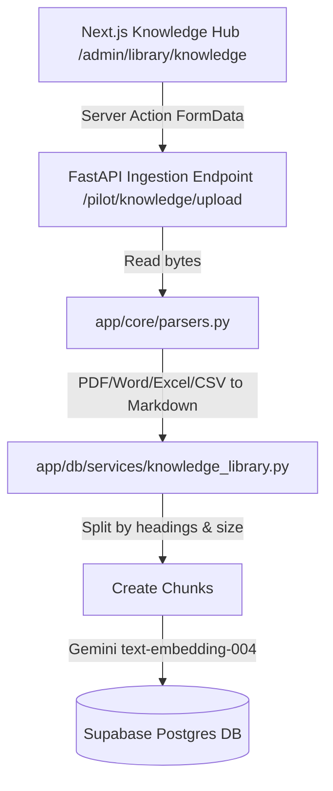

# 📖 Spec 17: RAG Knowledge Hub & Ingestion Pipeline

## 🎯 Platform Context
The RAG (Retrieval-Augmented Generation) & Knowledge Hub is designed for administrators and teachers to ingest local curriculum rubrics, course guidelines, and assignments (PDF, DOCX, XLSX, CSV, Markdown, Text). The engine chunks and indexes them to inject real-time semantic context into the AI criteria suggestion workflow.

---

## 🛠️ Architecture & Ingestion Flow



### Ingestion Components
1. **Frontend Interface**: `/admin/library/knowledge`
   * Ingest Document Panel (Title, access scope, file selector).
   * Hybrid Semantic Search Playground (Limit toggle, scope selectors, citation cards).
   * Document Registry Directory (Access scope, indexed status, chunk counts, deletion controls).
2. **Server Action**: `src/app/admin/library/actions/knowledge.ts`
   * Connects Next.js to FastAPI (`http://localhost:8080/pilot/knowledge/...`).
   * Forwards cookies and auth headers: `x-pilot-actor-user-id`, `x-pilot-organization-id`, `x-pilot-roles`.
3. **Backend Parsers**: `rubricore-engine/app/core/parsers.py`
   * Extracts text and compiles structured Markdown formats.
   * Leverages `pypdf`, `python-docx`, `openpyxl`, and standard `csv` reader.
4. **Embedding Generation**: `rubricore-engine/app/ai/gemini.py`
   * Embeds chunks via `text-embedding-004`.
   * **Self-Healing Fallback**: If the `batchEmbedContents` endpoint yields 404/503 errors (e.g. from specific regions/keys), the engine seamlessly falls back to sequential single-embed calls so the upload never crashes.

---

## 🔁 Verification Checks Run & Passed
* **Backend Pytest**: `pytest tests/test_knowledge_library_phase2.py` and `test_knowledge_library_db.py` pass cleanly.
* **Frontend Vitest**: `npm run test` executes all `133` unit assertions successfully.
* **Next.js Production Build**: `npm run build` compiles without errors.

---

## 📅 Roadmap: Tasks to do next (Macbook Handoff)

To prepare for tomorrow's work on your MacBook, here is the prioritize todo list:

### Task 1: Environment Sync on MacBook
- [ ] Pull latest changes on MacBook (`git pull`).
- [ ] Ensure local virtual environment has requirements installed:
  ```bash
  pip install -r rubricore-engine/requirements.txt
  ```
- [ ] Verify `pypdf`, `python-docx`, `openpyxl`, and `pytest` are fully installed.
- [ ] Check that `.env.local` contains the valid `GEMINI_API_KEY` and Supabase keys.

### Task 2: Background Async Ingestion (Celery / Worker Queue)
- [ ] Move document parsing and chunking for files > 5MB from the HTTP request thread into the background worker (`rubricore-engine/app/worker.py`).
- [ ] Render a "Processing" spinner state in the frontend table while the background task completes.

### Task 3: Context-Rich UI Enhancements
- [ ] **Document Previews**: Add a modal inside `/admin/library/knowledge` to preview the parsed markdown text of any uploaded document.
- [ ] **Citation Navigation**: Make citation blocks in search results linkable so teachers can expand/view the exact context surrounding the retrieved chunk.

### Task 4: Custom RAG Prompt Authoring
- [ ] Allow administrators to customize the RAG generation prompt template from the UI when recommending grading criteria.
