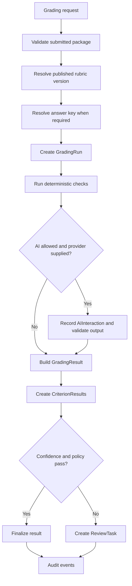

# Grading Orchestration Logic

This document describes the public Phase 1 grading orchestration logic for RubriCore-STE. It focuses on grading runs, deterministic-first execution, optional AI assistance, structured validation, confidence routing, review tasks, persistence, and auditability.

Submission immutability is described in [Answer Lifecycle](04-answer-lifecycle.md). Rubric versioning and deterministic score calculation are described in [Rubric Framework Logic](03-rubric-framework.md). Confidence policy details are described in [Confidence Policy Logic](06-confidence-policy.md). Durable persistence and artifact provenance are described in [Setup Database Logic](01-setupdb.md).

## Core Boundary

Grading orchestration turns a submitted answer package plus immutable grading context into an explainable result or teacher review task.

It should not:

- mutate submitted evidence
- mutate published rubric versions
- mutate published answer-key versions
- let AI define hidden domain semantics
- auto-finalize low-confidence or policy-exception cases
- rewrite historical grading outcomes in place

## Implemented Service Shape

The current backend slice adds `app.db.services.grading_orchestration` with a narrow Phase 1 service surface:

| Operation | Purpose |
| --- | --- |
| `resolve_grading_context` | Resolve the published rubric version and required answer key version before run creation |
| `orchestrate_grading_for_submission` | Resolve grading context for a submission, then start and execute one grading run |
| `start_grading_run` | Validate prerequisites, resolve fixed context, create a queued `GradingRun`, and audit creation |
| `execute_grading_run` | Run deterministic scoring, optional AI validation, result creation, routing, and completion/failure audit |
| `orchestrate_grading` | Convenience flow that starts and executes one grading run |
| `validate_ai_output` | Validate structured AI suggestions against the published rubric schema |
| `GradingPolicy` | Capture confidence thresholds, AI allowance, mandatory review, and policy version |

The service is intentionally not a distributed workflow engine. It is a small backend orchestration layer that can later be called from an API endpoint, background job, or batch runner.

## Required Context

A grading run requires:

- submitted `Submission`
- at least one usable `SubmissionEvidence` record
- published `RubricVersion`
- published `AnswerKeyVersion` when answer-key deterministic grading is required
- grading policy or default policy
- trigger source and optional triggering user

Rubric context is resolved by explicit `RubricVersion` first, then active assessment-item `RubricBinding`, then active assessment-level `RubricBinding`. If answer-key grading is required and no explicit answer key is provided, Phase 1 resolves the latest published answer key version for the submission's assessment item.

The exact rubric version and answer key version are copied onto the `GradingRun` and `GradingResult`. A later rubric binding or answer-key change should create a new run rather than mutating an in-progress or historical run.

## Pipeline



## Deterministic First

Deterministic scoring runs before AI. In the current slice, deterministic rubric scoring accepts selected performance levels by criterion and can also derive levels from answer-key rules. Supported Phase 1 answer-key rule shapes include exact text, normalized text, accepted variants, numeric exact, numeric tolerance, and regex checks. Deterministic scoring computes:

- per-criterion weighted scores
- total score
- maximum possible score
- deterministic confidence signal

Answer-key findings are persisted in criterion metadata when used. The service does not ask AI to choose or override deterministic facts before those facts are recorded. If deterministic and AI scores disagree, the result routes to teacher review.

## AI Boundary

AI assistance is optional and provider-agnostic.

The provider protocol requires:

- `provider_name`
- `model_name`
- `evaluate(request_payload)`

When AI is used, the service records an `AIInteraction` with provider, model, prompt version, output schema version, request metadata, response payload, validation status, and error message when applicable.

AI output must include structured criterion suggestions. Each suggestion is validated against:

- known criterion keys from the published rubric version
- criterion-specific weighted maximum score
- confidence range from 0 to 1
- required explanation text
- evidence reference shape, and known submitted evidence IDs when the provider was given a bounded evidence-reference set

Invalid AI output is not used for authoritative scores. It is preserved as an invalid interaction and audited. If AI is required, or deterministic scoring does not already provide complete rubric coverage, invalid AI output routes the result to review; otherwise complete deterministic scoring can still pass the normal policy gates.

## Confidence and Review Routing

Detailed confidence definitions, bands, and policy gates are described in [Confidence Policy Logic](06-confidence-policy.md).

The result may auto-finalize only when:

- the submission and grading context are valid
- deterministic checks completed
- AI output is valid when AI is required or used for scoring
- required rubric criteria are covered by deterministic or valid AI results
- AI evidence references validate when AI contributes scoring
- all scores are inside rubric bounds
- confidence meets the configured threshold
- no mandatory review policy applies
- no deterministic/AI disagreement exists

The service creates a `ReviewTask` when:

- confidence is below threshold
- required rubric coverage is incomplete
- AI output is invalid or failed while AI is required
- deterministic and AI outputs disagree
- deterministic scoring is partial, blocked, or warning-bearing
- policy disables auto-finalization
- policy requires review

Review tasks preserve confidence band, escalation reason, policy payload, grading run ID, grading result ID, and submission context.

## Persistence

The orchestration slice creates or updates:

| Record | Role |
| --- | --- |
| `GradingRun` | Execution attempt and fixed grading context |
| `GradingResult` | Proposed, finalized, or review-routed outcome |
| `CriterionResult` | Criterion-level source, score, max score, confidence, explanation, and metadata |
| `AIInteraction` | Provider call trace and validation status |
| `ReviewTask` | Human-in-the-loop queue item |
| `AuditEvent` | Append-only state transition history |

## Current Verification

Run the grading orchestration tests:

```sh
.venv/bin/pytest tests/test_grading_orchestration.py
```

Run the full suite:

```sh
.venv/bin/pytest
```

The current tests cover prerequisite validation, context resolution, answer-key-required behavior, answer-key deterministic rules, deterministic auto-finalization, AI validation, deterministic/AI disagreement routing, invalid AI output routing, low-confidence review routing, full-coverage AI-only finalization, evidence-reference validation, optional invalid AI behavior, mandatory review gates, incomplete coverage review routing, deterministic warning routing, and run/result context persistence.

## Phase 1 Limits

This slice intentionally defers:

- API endpoints
- background queues
- batch grading
- multi-reviewer workflows
- appeals case management
- provider routing or fallback policy
- automated rubric or answer-key mutation
- detailed deterministic trace tables

Those features can build on the same run/result/review/audit boundary later.
