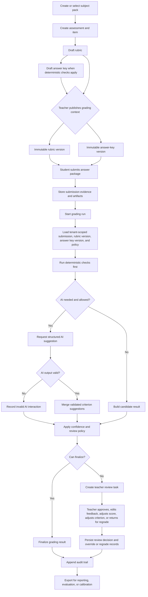
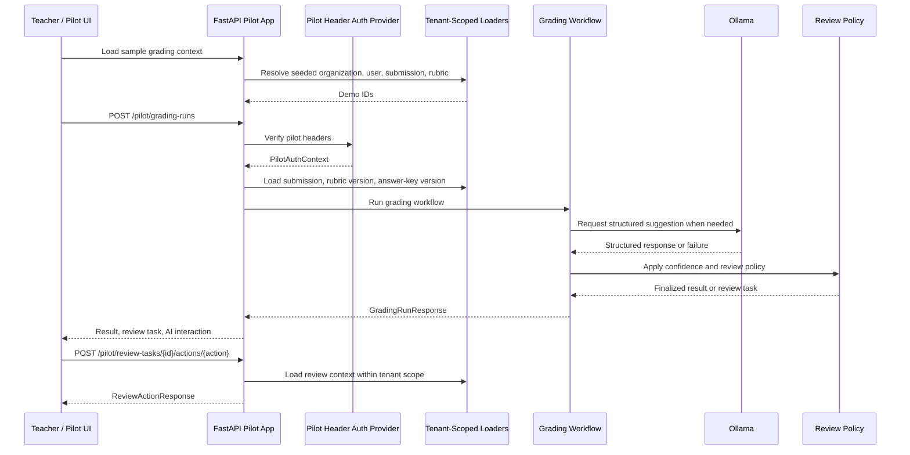

# RubriCore-STE Release Review

This document restates the current RubriCore-STE feature set as a reviewable release package. It covers implemented backend capabilities, the end-to-end pilot flow, API-facing surfaces, and the use cases the current system is meant to support.

RubriCore-STE is still a backend-first pilot foundation. The release includes service logic, persistence, contracts, public-safe fixtures, local pilot routes, a small FastAPI pilot UI, and a local Ollama grading adapter. It is not yet a production SaaS application, production auth system, hosted grading product, or teacher-facing full UI.

## Release Positioning

RubriCore-STE helps teachers and assessment teams grade varied student work with explicit rubric versions, deterministic checks, structured AI assistance, teacher review, and auditable decisions.

The release should be reviewed as:

| Area | Release status |
| --- | --- |
| Core grading model | Implemented as backend services and database models |
| Rubric and answer-key versioning | Implemented as draft and immutable published-version workflows |
| Submission and evidence lifecycle | Implemented as durable models and services |
| Deterministic-first grading | Implemented in grading orchestration |
| AI-assisted grading | Implemented through provider boundary plus local Ollama adapter |
| Teacher review actions | Implemented in service layer and FastAPI review-action route |
| Audit trail | Implemented for major lifecycle, grading, rubric, review, and knowledge actions |
| Knowledge library | Implemented as backend source registration, conversion, chunking, retrieval candidates, and cited suggestions |
| Evaluation and calibration | Implemented for public-safe fixtures and reviewed-result export helpers |
| Pilot HTTP/API surface | Implemented for public-safe fixture/evaluation routes and selected auth-aware DB-backed FastAPI routes |
| Pilot UI | Implemented as a development/demo page for seeded local grading and review actions |
| Production auth | Designed, but not implemented as real OAuth/OIDC/JWT verification |
| Production deployment | Deferred |
| Full teacher/student UI | Deferred |

## Released Features

### 1. Assessment Taxonomy

RubriCore-STE defines portable vocabulary for assessment type, evidence type, output type, rubric type, and subject pack. This lets the system describe a programming assignment, math item, constructed response, visual critique, or mixed artifact without hard-coding a discipline into grading logic.

Current support includes:

| Feature | Review notes |
| --- | --- |
| Assessment types | Multiple choice, numeric, short answer, constructed response, code, lab, project, oral, visual, and mixed-format concepts |
| Evidence types | Text, numeric values, code, files, images, audio, video, tables, and mixed bundles as taxonomy values |
| Rubric types | Binary key, checklist, analytic, holistic, and criterion-weighted scoring |
| Subject packs | Portable configuration boundary for discipline-specific defaults |
| Validation | Tests protect known taxonomy keys and compatibility behavior |

### 2. Database Foundation and Provenance

The system has SQLAlchemy models and Alembic migrations for organizations, users, courses/classes, assessments, items, submissions, evidence, artifacts, rubrics, answer keys, grading runs, results, review records, knowledge sources, and audit events.

Current support includes:

| Feature | Review notes |
| --- | --- |
| Durable IDs | UUID-backed domain records |
| Artifact preservation | Submitted files and source materials are tracked as artifacts before interpretation |
| Provenance links | Evidence, extraction, conversion, grading, review, and audit records can be traced |
| PostgreSQL posture | Schema is PostgreSQL-oriented while tests use controlled local fixtures |
| Migrations | Current schema is represented through Alembic revisions |

### 3. Rubric Framework

Rubrics can be drafted, published, versioned, bound to assessments, and used for deterministic or AI-assisted scoring.

Current support includes:

| Feature | Review notes |
| --- | --- |
| Draft rubrics | Editable rubric schema before publish |
| Published rubric versions | Immutable published snapshots |
| Criteria and levels | Criteria, level descriptors, scores, and weights are materialized |
| Bindings | Rubric versions can be bound to assessment context |
| Deterministic scoring | Selected levels can produce criterion scores and totals |
| Audit | Publish and update actions are auditable |

### 4. Answer-Key Lifecycle

Answer keys can be created as drafts, updated before publish, and published into immutable versions used during grading.

Current support includes:

| Feature | Review notes |
| --- | --- |
| Draft answer keys | Accepted values and structured rules are validated |
| Published answer-key versions | Immutable version snapshots are used for grading |
| Version selection | Grading can use an explicit answer-key version or resolve the latest valid one |
| Deterministic checks | Exact accepted values and rule-driven checks can contribute criterion findings |
| Failure routing | Unsupported or warning-producing answer-key rules route to review |

### 5. Answer and Submission Lifecycle

Student work is modeled as immutable submitted answer packages with evidence records and lifecycle states.

Current support includes:

| Feature | Review notes |
| --- | --- |
| Answer states | Draft, submitted, superseded, withdrawn, and archived states |
| Immutable submitted package | Submitted evidence is preserved instead of overwritten |
| Revisions | Later submissions can supersede earlier ones |
| Regrade path | Review can return a result for regrade without rewriting history |
| Evidence linkage | Submission evidence points back to artifacts and assessment context |

### 6. Grading Orchestration

The grading pipeline loads the exact grading context, runs deterministic checks first, optionally asks an AI provider for structured suggestions, validates the response, computes confidence, and either finalizes or routes to review.

Current support includes:

| Feature | Review notes |
| --- | --- |
| Grading runs | A run records the context and status of a grading attempt |
| Deterministic-first execution | Answer-key and selected-level findings run before AI is treated as needed |
| AI provider boundary | AI is isolated behind a provider interface |
| Structured AI validation | AI suggestions must match the expected structured shape before use |
| Confidence policy | Thresholds, mandatory-review flags, incomplete coverage, disagreement, and invalid AI output drive routing |
| Result export | Grading results can be exported into response contracts |
| Audit | Runs, result decisions, AI failures, and review routing are traceable |

### 7. Local AI Provider

The release includes a local Ollama-backed grading provider for development and pilot evaluation.

Current support includes:

| Feature | Review notes |
| --- | --- |
| Provider | `OllamaGradingProvider` |
| Default model | `llama3.2:1b` |
| Default host | `http://localhost:11434` |
| Route integration | `POST /pilot/grading-runs` can call Ollama through the grading workflow |
| Safety posture | Local provider output remains structured, validated, confidence-routed, and auditable |

### 8. Confidence and Review Routing

RubriCore-STE decides whether a result can finalize or needs human review using policy inputs rather than hidden model trust.

Current support includes:

| Trigger | Expected behavior |
| --- | --- |
| High confidence and full coverage | Finalize when auto-finalization is allowed |
| Mandatory review | Create a review task |
| Low or medium confidence | Route to review |
| Incomplete criterion coverage | Route to review |
| Deterministic and AI disagreement | Route to review |
| Invalid AI output | Preserve invalid interaction and route to review when needed |
| Answer-key warnings | Route to review |

### 9. Teacher Review

Teacher review is an explicit product surface, not an exception path.

Current support includes:

| Feature | Review notes |
| --- | --- |
| Review tasks | Created when policy requires teacher attention |
| Approve result | Teacher can approve a pending result |
| Edit feedback | Teacher can revise feedback with a reason |
| Adjust total score | Teacher can override the total with a reason |
| Adjust criterion score | Teacher can override an individual criterion result |
| Return for regrade | Teacher can request another grading run |
| Audit | Teacher decision, previous value, new value, reason, and related context are preserved |

### 10. Knowledge Library

Teacher knowledge can become reusable grading context through source registration, conversion, chunking, retrieval candidates, suggestions, and teacher approval.

Current support includes:

| Feature | Review notes |
| --- | --- |
| Source registration | Markdown and plain-text sources can be registered as knowledge sources |
| Artifact preservation | Original and converted artifacts are tracked |
| Local conversion | Supported local text formats can be normalized to Markdown |
| Chunking | Sources can be split into retrieval-ready chunks |
| Retrieval candidates | Non-vector candidate selection supports cited suggestions |
| Rubric suggestions | Suggestion drafts can cite source chunks |
| Teacher decisions | Suggestions require approval or rejection before influencing rubric drafts |
| Immutability guardrail | Accepted suggestions update drafts only; published rubric versions remain immutable |

### 11. Evaluation and Calibration Foundation

The release includes public-safe evaluation fixtures and helpers for comparing grading outputs.

Current support includes:

| Feature | Review notes |
| --- | --- |
| Public fixture boundary | Synthetic fixtures live under `tests/fixtures/public/` |
| Private data boundary | Real/private evaluation data must stay in ignored local paths |
| Manifest validation | Public fixture manifests can be validated |
| Baseline reports | Evaluation helpers compare score, criterion, finalization, and review-routing outcomes |
| Calibration export | Finalized reviewed or overridden results can be exported into evaluation shape |
| Smoke scripts | Local scripts exercise public fixture ingestion and evaluation workflows |

### 12. Pilot Contracts and Workflows

The product exposes stable Pydantic contracts and Python workflow functions intended to be reused by routes, jobs, CLIs, and future UI adapters.

Current support includes:

| Contract/workflow area | Current shape |
| --- | --- |
| Subject pack | Create and summarize subject packs in the service/workflow layer |
| Answer key | Create draft, update draft, publish version |
| Review tasks | Validate list filters and produce task summaries |
| Rubric drafts | Update mutable draft schema |
| Fixture manifests | Validate public-safe fixture manifests |
| Evaluation baseline | Produce public baseline reports |
| Grading runs | Start tenant-scoped grading from API request contracts |
| Review actions | Apply teacher review actions from API request contracts |

### 13. Pilot API Surface

The release has two pilot API boundaries:

| Boundary | Routes |
| --- | --- |
| Stdlib pilot HTTP | `GET /pilot/health`, `GET /pilot/routes`, `POST /pilot/fixtures/manifest/validate`, `POST /pilot/evaluation/public-baseline` |
| FastAPI pilot app | `GET /pilot/health`, `GET /pilot/ui`, `GET /pilot/demo/sample-grading-context`, `POST /pilot/fixtures/manifest/validate`, `POST /pilot/evaluation/public-baseline`, `GET /pilot/subject-packs/{key}`, `POST /pilot/grading-runs`, `POST /pilot/review-tasks/{review_task_id}/actions/{action}` |

The FastAPI DB-backed routes use pilot auth headers and tenant-scoped object loaders. The current auth provider is development-only and should not be reviewed as production authentication.

### 14. Development Pilot UI

The FastAPI app includes a local pilot UI at `GET /pilot/ui`.

Current support includes:

| Feature | Review notes |
| --- | --- |
| Load sample data | Pulls seeded local IDs from `GET /pilot/demo/sample-grading-context` |
| Run grading | Calls `POST /pilot/grading-runs` |
| Review outcome | Shows grading result, review task, and AI interaction summary |
| Submit review action | Calls review action route for supported teacher actions |
| Development-only scope | Intended for local seeded demos, not production use |

### 15. Auth and Tenancy Guardrails

The release includes a clear auth and tenancy design boundary plus development pilot auth provider.

Current support includes:

| Feature | Review notes |
| --- | --- |
| Pilot auth context | Actor, organization, role, permissions, and request id |
| Permission map | DB-backed route templates map to required permissions |
| Tenant-scoped loaders | Subject pack, submission, rubric, answer key, review task, and grading result loaders include org scope |
| Auth provider interface | `AuthProvider.verify_request(...) -> PilotAuthContext` |
| Development provider | Explicit pilot headers create auth context for local tests and demos |
| Production plan | OIDC/JWT bearer tokens are selected as future production auth style |

## End-To-End Flow

The complete intended product flow is:

### Flow Detail

1. Admin or teacher configures a subject pack and assessment taxonomy.
2. Teacher drafts a rubric with criteria, levels, weights, and descriptors.
3. Teacher optionally drafts an answer key with accepted values or deterministic rules.
4. Teacher publishes the rubric and answer key into immutable versions.
5. Student submits answer evidence.
6. The system stores submitted evidence and any related artifact metadata.
7. A grading run starts with explicit submission, rubric, answer-key, and policy inputs.
8. Deterministic checks run first and record findings.
9. If semantic judgment is needed and AI is allowed, the provider receives structured grading context.
10. AI output is validated before it can contribute to results.
11. The confidence policy checks score coverage, confidence, disagreements, warnings, and mandatory-review flags.
12. The result finalizes automatically only when policy permits.
13. Otherwise, the system creates a review task.
14. Teacher review can approve, edit feedback, adjust total score, adjust criterion score, or return for regrade.
15. Audit records preserve the decision path, actor, request id, rubric and answer-key versions, evidence links, and review reasons.
16. Finalized reviewed results can later feed evaluation and calibration reports.

## API Review Flow

For the current local pilot release:

## Use Cases For Review

### Assessment Setup

| Use case | Current status |
| --- | --- |
| Create a subject pack for a discipline | Backend workflow implemented |
| Define allowed assessment/evidence/rubric/output types | Taxonomy and subject-pack config boundary implemented |
| Create a multiple-choice item | Supported by taxonomy and backend model shape |
| Create a numeric item | Supported by taxonomy and answer-key rule shape |
| Create a short-answer item | Supported by taxonomy, answer keys, and rubrics |
| Create a constructed-response item | Supported by taxonomy, rubrics, AI boundary, and review |
| Create a code assignment | Supported by fixtures, artifact/evidence model, and grading route |
| Create lab/project/oral/visual/mixed assessments | Supported by taxonomy and artifact-first design; specialized adapters are deferred |
| Archive an assessment configuration without losing history | Supported by versioning and status patterns in backend model shape |

### Rubric Authoring

| Use case | Current status |
| --- | --- |
| Draft an analytic rubric | Implemented |
| Draft a checklist rubric | Implemented by rubric schema and criteria patterns |
| Draft a holistic rubric | Supported by taxonomy and schema boundary |
| Draft a criterion-weighted rubric | Implemented through criterion weights |
| Add criteria and scoring levels | Implemented |
| Attach descriptors and feedback guidance | Implemented in rubric schema/version payloads |
| Publish a rubric version | Implemented |
| Prevent direct edits to a published version | Implemented by versioning model and service rules |
| Create a new draft from improved guidance | Supported in backend rubric draft workflow |
| Preserve old results under old rubric versions | Implemented by versioned grading context |

### Answer-Key Authoring

| Use case | Current status |
| --- | --- |
| Create an answer-key draft | Implemented |
| Update a draft answer key | Implemented |
| Publish an answer-key version | Implemented |
| Score accepted exact values | Implemented |
| Use deterministic rule payloads | Implemented for supported rule shapes |
| Route unsupported rules to review | Implemented |
| Require answer key for a grading run | Implemented via grading request policy |
| Trigger later regrade from new answer-key version | Review/regrade foundation implemented; batch regrade runner deferred |

### Knowledge Library

| Use case | Current status |
| --- | --- |
| Register teacher notes as knowledge source | Implemented |
| Store original source artifact | Implemented |
| Convert Markdown or plain text to normalized Markdown | Implemented |
| Track conversion metadata and warnings | Implemented |
| Chunk source text | Implemented |
| Retrieve candidate chunks without vector search | Implemented |
| Generate rubric suggestion drafts with citations | Implemented as backend suggestion workflow |
| Approve suggestion into rubric draft | Implemented |
| Reject suggestion and preserve decision | Implemented |
| Use PDF/DOCX/rich parsing | Deferred |
| Use vector retrieval | Deferred |

### Submission Intake

| Use case | Current status |
| --- | --- |
| Submit text evidence | Backend model supports it |
| Submit numeric evidence | Backend model supports it |
| Submit code evidence | Supported by fixture and artifact/evidence model |
| Submit file artifacts | Artifact-first model implemented |
| Submit documents/images/audio/video/archives | Artifact taxonomy and preservation model support this; specialized extraction adapters are deferred |
| Submit mixed evidence bundles | Model shape supports multiple evidence records |
| Preserve unsupported formats | Artifact preservation and failure-routing posture implemented |
| Supersede an earlier submission | Answer lifecycle supports superseding |
| Withdraw or archive an answer package | Lifecycle states implemented |

### Grading

| Use case | Current status |
| --- | --- |
| Run deterministic grading without AI | Implemented |
| Run AI-assisted grading when needed | Implemented with Ollama provider |
| Force AI-required grading | Implemented via grading request policy |
| Disable AI for a run | Implemented via grading request policy |
| Auto-finalize high-confidence complete result | Implemented |
| Route low-confidence result to review | Implemented |
| Route incomplete criterion coverage to review | Implemented |
| Route deterministic/AI disagreement to review | Implemented |
| Preserve invalid AI interaction | Implemented |
| Export grading result shape | Implemented |
| Run batch grading | Deferred |
| Retry provider failures with budgets | Deferred |
| Compare provider/model regressions | Evaluation foundation exists; full regression suite deferred |

### Teacher Review

| Use case | Current status |
| --- | --- |
| Create review task from policy | Implemented |
| Summarize review task | Implemented |
| Approve grading result | Implemented |
| Edit feedback | Implemented |
| Adjust total score | Implemented |
| Adjust individual criterion score | Implemented |
| Return result for regrade | Implemented |
| Require reason for teacher action | Implemented |
| Preserve teacher override record | Implemented |
| Expose full review queue over HTTP | Deferred |

### Audit, Evaluation, and Calibration

| Use case | Current status |
| --- | --- |
| Trace grading decision to submission, rubric, answer key, AI output, and review | Implemented through linked records and audit events |
| Validate public fixture manifest | Implemented |
| Run public baseline evaluation | Implemented |
| Export reviewed results for calibration | Implemented |
| Compare score and criterion outcomes | Implemented in evaluation helpers |
| Track override/review patterns | Backend records exist; analytics UI deferred |
| Use real private datasets safely | Boundary documented; private dataset runner remains local-only |

### API and Integration

| Use case | Current status |
| --- | --- |
| Check pilot service health | Implemented |
| Discover stdlib pilot routes | Implemented |
| Validate fixture manifest over HTTP | Implemented |
| Produce public evaluation baseline over HTTP | Implemented |
| Read subject-pack summary over authenticated FastAPI route | Implemented |
| Run authenticated grading over FastAPI route | Implemented |
| Submit authenticated review action over FastAPI route | Implemented |
| Use development pilot headers | Implemented |
| Use production OIDC/JWT | Designed, not implemented |
| Deploy production API | Deferred |
| Generate full OpenAPI product contract | FastAPI has route models; production contract hardening deferred |

## Primary Release Scenarios

### Scenario 1: Local Pilot Grading Demo

1. Developer seeds local demo data.
2. Teacher opens `/pilot/ui`.
3. UI loads seeded actor, organization, submission, and rubric IDs.
4. Teacher runs grading.
5. API verifies pilot headers.
6. API loads tenant-scoped objects.
7. Grading workflow applies deterministic and AI-assisted scoring.
8. Result finalizes or creates a review task.
9. Teacher reviews if needed.

### Scenario 2: Public Fixture Evaluation

1. Developer selects a public-safe fixture manifest.
2. System validates the manifest.
3. Evaluation helper loads synthetic expected cases.
4. Baseline report compares scores, criterion outcomes, and routing.
5. Results stay safe for public repository use.

### Scenario 3: Teacher Knowledge Becomes Rubric Guidance

1. Teacher registers Markdown or text guidance.
2. System stores the source artifact and normalized knowledge source.
3. Source is chunked for retrieval candidates.
4. System drafts cited rubric suggestions.
5. Teacher accepts or rejects each suggestion.
6. Accepted suggestions update a mutable rubric draft.
7. Publishing still creates a new immutable rubric version.

### Scenario 4: Low-Confidence AI-Assisted Grading

1. Student submits open-ended work.
2. Deterministic checks cannot fully grade the evidence.
3. AI provider returns a structured suggestion.
4. Confidence falls below policy threshold or coverage is incomplete.
5. System creates a review task.
6. Teacher adjusts feedback or scores and records a reason.
7. Final decision and audit trail are preserved.

### Scenario 5: Deterministic Answer-Key Grading With Review Escape Hatch

1. Student submits a short answer or numeric answer.
2. Published answer-key rules run first.
3. Clear accepted value produces a deterministic score.
4. Unsupported rule, warning, ambiguity, or disagreement routes to review.
5. Teacher resolves the case and preserves the decision reason.

## Deferred Work To Keep Out Of This Release

These are intentionally not part of the current release claim:

| Deferred area | Reason |
| --- | --- |
| Production OAuth/OIDC/JWT verification | Designed, but no real verifier, secrets, JWKS fetch, or provider configuration exists |
| Full teacher-facing UI | Current UI is a local pilot demo |
| Student-facing submission UI | Backend model exists; user-facing intake is deferred |
| Rich document parsing | Markdown/plain-text conversion exists; PDF/DOCX extraction is deferred |
| Vector search | Non-vector retrieval candidates exist; vector retrieval is deferred |
| Batch grading runner | Single-run route exists; batch orchestration is deferred |
| Provider router and retry budgets | One local Ollama adapter exists |
| Hosted deployment package | Local development and tests are supported |
| Review queue HTTP list route | Service/contracts exist; route is deferred |
| Answer-key and rubric mutation HTTP routes | Backend workflows exist; public route exposure is deferred |
| Production analytics dashboard | Data is captured; reporting UI is deferred |

## Review Checklist

Use this checklist to decide whether the release story is acceptable:

| Question | Expected answer |
| --- | --- |
| Does every grading result point to the exact rubric and answer-key version used? | Yes |
| Can deterministic checks run before AI? | Yes |
| Can AI output be rejected when invalid? | Yes |
| Can low-confidence or ambiguous work route to teacher review? | Yes |
| Can teachers override scores or feedback with reasons? | Yes |
| Are published rubrics and answer keys immutable? | Yes |
| Are public fixtures synthetic and safe? | Yes |
| Is production auth implemented? | No |
| Is this a production UI? | No |
| Are schema, docs, tests, and service boundaries aligned? | Yes, pending normal release review |

## Source Map

| Topic | Source |
| --- | --- |
| Product overview | [README.md](../README.md) |
| Use cases and case studies | [docs/use-cases-and-case-studies.md](use-cases-and-case-studies.md) |
| Setup | [docs/setup.md](setup.md) |
| Database foundation | [docs/logic/01-setupdb.md](logic/01-setupdb.md) |
| Assessment taxonomy | [docs/logic/02-assessment-taxonomy.md](logic/02-assessment-taxonomy.md) |
| Rubric framework | [docs/logic/03-rubric-framework.md](logic/03-rubric-framework.md) |
| Answer lifecycle | [docs/logic/04-answer-lifecycle.md](logic/04-answer-lifecycle.md) |
| Grading orchestration | [docs/logic/05-grading-orchestration.md](logic/05-grading-orchestration.md) |
| Confidence policy | [docs/logic/06-confidence-policy.md](logic/06-confidence-policy.md) |
| Review policy | [docs/logic/07-review-policy.md](logic/07-review-policy.md) |
| Audit logging | [docs/logic/08-audit-logging.md](logic/08-audit-logging.md) |
| Knowledge library | [docs/logic/09-knowledge-library.md](logic/09-knowledge-library.md) |
| API productization | [docs/logic/15-phase4-api-productization.md](logic/15-phase4-api-productization.md) |
| Production API readiness | [docs/logic/16-phase5a-production-api-readiness.md](logic/16-phase5a-production-api-readiness.md) |
| Auth and tenancy design | [docs/logic/17-phase5b-auth-tenancy-design.md](logic/17-phase5b-auth-tenancy-design.md) |
| FastAPI route boundary | [docs/logic/19-phase6a-fastapi-subject-pack-route.md](logic/19-phase6a-fastapi-subject-pack-route.md) |
| Auth provider adapter | [docs/logic/20-phase6b-auth-provider-adapter.md](logic/20-phase6b-auth-provider-adapter.md) |
| Local AI provider | [docs/logic/23-phase6e-local-ai-provider.md](logic/23-phase6e-local-ai-provider.md) |
