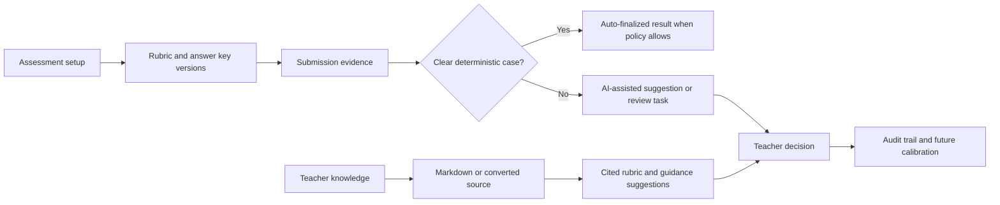
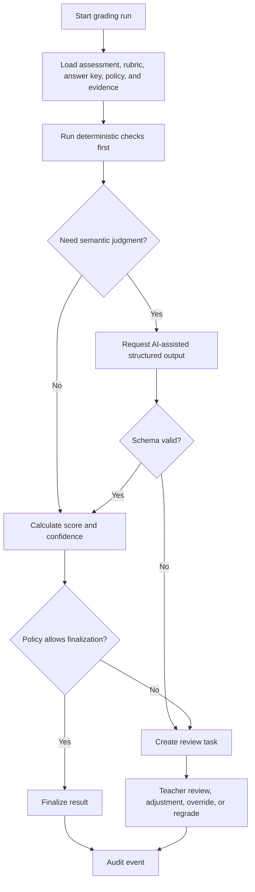
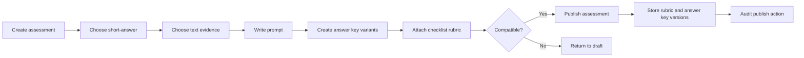
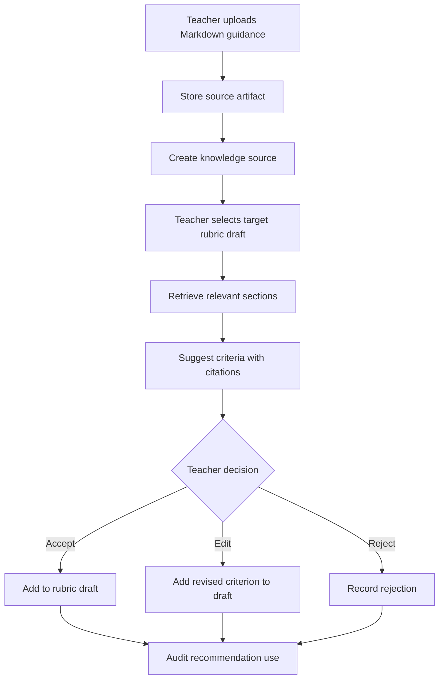
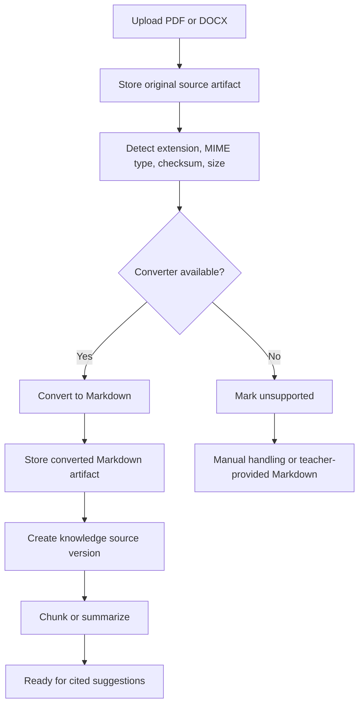
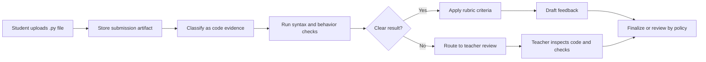
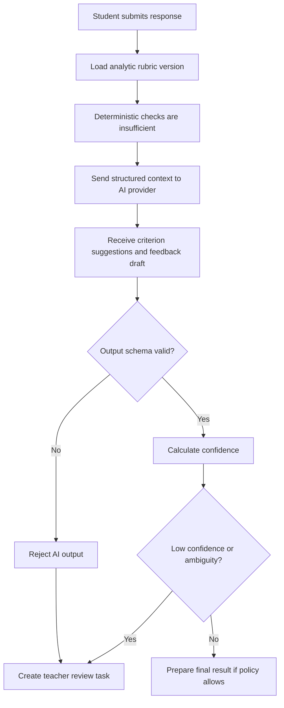
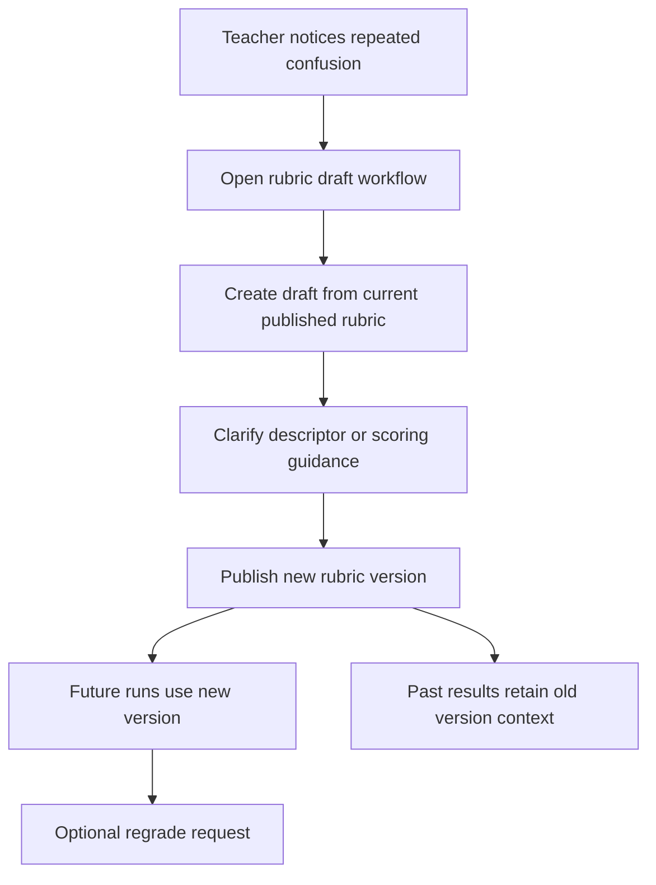
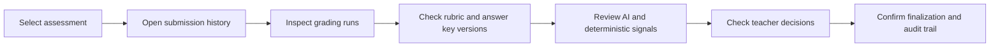
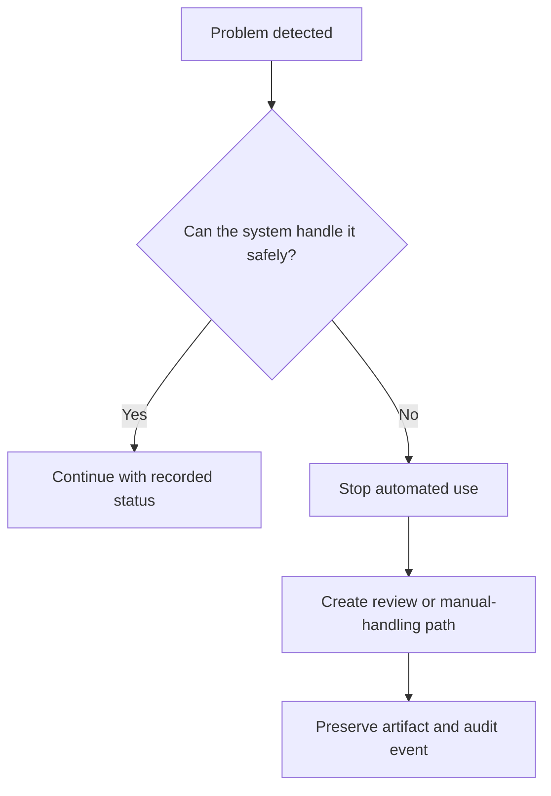

# RubriCore-STE Use Cases and Case Studies

RubriCore-STE is designed around a simple promise: preserve teacher authority while making grading workflows more consistent, traceable, and reusable.

This guide combines the public use-case inventory with narrative case studies. The use cases describe what the platform should support; the case studies show how those capabilities fit together in real teaching and review workflows.

## At a Glance

| Reader question | Where to look |
| --- | --- |
| What workflows should the platform support? | [Capability Map](#capability-map) |
| How does teacher-added knowledge become useful? | [Case Study 2](#case-study-2-teacher-adds-knowledge-for-rubric-suggestions) and [Case Study 3](#case-study-3-document-conversion-becomes-reusable-knowledge) |
| How does grading move from evidence to review? | [Case Study 4](#case-study-4-student-submits-a-code-assignment) and [Case Study 5](#case-study-5-ai-assisted-open-ended-grading) |
| How are errors handled safely? | [Failure and Safety Paths](#failure-and-safety-paths) |
| What must remain private? | [Privacy and Access Control](#privacy-and-access-control) |

## Core Principle

RubriCore-STE should help teachers build better grading systems over time, but it should not quietly take authority away from them.

| System behavior | Required guardrail |
| --- | --- |
| Deterministic checks grade clear answers | Use explicit rules and preserve the version used |
| AI suggests interpretations, feedback, or rubric ideas | Validate structured output before use |
| Teacher knowledge informs future rubrics | Keep citations, access scope, and approval status |
| Review changes a grade or feedback | Store previous value, new value, actor, and reason |
| A file cannot be parsed | Preserve the artifact and route to manual handling when needed |

## Concise Use Cases

These use cases describe the main capabilities RubriCore-STE should support.

### Capability Map

#### Assessment Authoring

Teachers and admins should be able to create assessments without hard-coding a subject into the core system.

| Capability | Examples |
| --- | --- |
| Assessment types | Multiple-choice, numeric answer, short answer, constructed response, code assignment, lab report, project, oral explanation, visual critique |
| Evidence types | Text, numeric input, code, file upload, image, audio, video, table data, mixed evidence bundles |
| Subject packs | Data, Programming, Math, Physics, Art, or future discipline packs |
| Publishing controls | Draft state, compatibility validation, publish action, archive without deleting history |

#### Knowledge Library

The knowledge library is where teacher-added material becomes reusable grading knowledge.

| Capability | Expected behavior |
| --- | --- |
| Upload Markdown | Store as a source artifact and knowledge source |
| Upload documents or code notes | Preserve the original artifact, convert when supported, keep conversion metadata |
| Curate collections | Group knowledge sources by subject pack, skill, assessment type, evidence type, or rubric type |
| Request suggestions | Generate rubric criteria, scoring guidance, feedback themes, accepted variants, or review support |
| Approve suggestions | Accepted suggestions enter drafts only; publishing still requires normal rubric versioning |
| Preserve provenance | Show source citations, access scope, and recommendation history |

#### Rubrics and Answer Keys

Rubrics and answer keys should be editable while in draft, immutable once published, and explicit when revised.

| Area | Use cases |
| --- | --- |
| Rubrics | Binary key, checklist, analytic rubric, holistic rubric, criterion-weighted rubric |
| Criteria | Scoring bands, criterion weights, evidence mappings, skill tags |
| Answer keys | Exact match, numeric tolerance, accepted text variants, regex matching, reference solution files |
| Versioning | Publish immutable versions, create new versions after edits, trigger regrade when a new version is selected |

#### Submission and Evidence Intake

The system should treat every file as an artifact before trying to interpret it.

| Intake path | Expected behavior |
| --- | --- |
| Text or numeric evidence | Store directly and link to the submission |
| Code files | Store source, classify as code, run configured checks where available |
| Documents | Store original file, extract or convert when supported |
| Images, audio, video, archives | Store metadata and route through supported adapters or review |
| Unknown formats | Preserve artifact, mark unsupported, and avoid silent failure |

#### Grading, Review, and Audit

## Step-by-Step Case Studies

These case studies show how the concise use cases fit together in practical teaching, grading, review, and audit workflows.

### Case Study 1: Teacher Creates a Short-Answer Assessment

**Scenario:** A teacher wants a short-answer item that accepts a few valid variants but still routes ambiguity to review.

**Key use cases covered:** assessment creation, evidence classification, answer key management, rubric publishing, auditability.

### Case Study 2: Teacher Adds Knowledge for Rubric Suggestions

**Scenario:** A teacher uploads grading notes and asks the system to suggest rubric criteria for a draft.

**Design intent:** teacher-added knowledge can teach the system, but only through cited suggestions and teacher approval.

### Case Study 3: Document Conversion Becomes Reusable Knowledge

**Scenario:** A teacher has a PDF or DOCX note and wants it available as reusable rubric guidance.

**Key use cases covered:** artifact preservation, conversion metadata, unsupported parser handling, knowledge source versioning.

### Case Study 4: Student Submits a Code Assignment

**Scenario:** A learner uploads Python code for a score-summary exercise.

**Key use cases covered:** file evidence intake, deterministic checks, rubric grading, review escalation.

### Case Study 5: AI-Assisted Open-Ended Grading

**Scenario:** A constructed response needs semantic interpretation and partial-credit suggestions.

**Design intent:** AI can contribute suggestions, but validation and policy decide whether a teacher must review.

### Case Study 6: Teacher Reviews a Low-Confidence Case

**Scenario:** A teacher opens the review queue and resolves an uncertain result.

**Key use cases covered:** review queue, teacher override, finalization, traceability.

### Case Study 7: Rubric Improves After Real Submissions

**Scenario:** Repeated reviews reveal that a criterion is ambiguous.

**Design intent:** the platform can learn from teacher practice without rewriting historical grading context.

### Case Study 8: Admin Audits a Grading Decision

**Scenario:** An admin needs to understand why a student received a particular result.

**Key use cases covered:** audit events, grading history, evidence provenance, teacher accountability.

## Failure and Safety Paths

| Failure path | Expected system response |
| --- | --- |
| Unsupported file format | Store artifact, mark unsupported, route to manual handling if needed |
| Markdown conversion fails | Keep source artifact, store warnings/errors, avoid activating bad knowledge |
| AI output fails validation | Reject output, log validation failure, create review task |
| Rubric is ambiguous | Lower confidence, route to review, support future rubric revision |
| Teacher tries to edit published rubric directly | Require a new draft and new published version |
| Private source is outside requester scope | Exclude from retrieval and recommendation |

## Privacy and Access Control

Knowledge, evidence, and fixtures must respect their intended scope.

| Scope | Meaning |
| --- | --- |
| `private` | Visible only to the owner or explicitly allowed users |
| `course` | Available within a course or class context |
| `organization` | Available inside one organization |
| `subject-pack` | Available through subject-pack configuration |
| `public-safe` | Safe for public examples and public fixtures |

Public documentation and fixtures must not include real student data, private answer keys, private prompts, private knowledge sources, credentials, or unpublished evaluation datasets.

## Full Use-Case Checklist

Use this checklist when planning implementation coverage.

| Area | Representative use cases |
| --- | --- |
| Assessment creation | Create quiz, numeric, short-answer, constructed-response, code, lab, project, oral, visual, and mixed-format assessments |
| Subject packs | Suggest default templates, allowed evidence, vocabulary, deterministic rules, and feedback style |
| Knowledge library | Upload sources, convert documents, group collections, tag by skill, request and approve cited suggestions |
| Document conversion | Convert supported files to Markdown, preserve source artifacts, track converter warnings |
| Rubric management | Draft criteria, add bands and weights, map criteria to evidence and skills, publish immutable versions |
| Answer keys | Define exact answers, tolerances, accepted variants, regex matches, reference code, and regrade triggers |
| Submission intake | Accept selected option, numeric, text, Markdown, document, code, spreadsheet, image, audio, video, archive, and mixed evidence |
| Grading orchestration | Run deterministic checks first, request AI when needed, validate AI output, calculate confidence, finalize or escalate |
| Teacher review | Inspect evidence, checks, AI summaries, citations, adjust scores, edit feedback, override, return for regrade |
| Audit and analytics | View grading history, rubric usage, answer key versions, review volume, override frequency, conversion failures, source usage |
